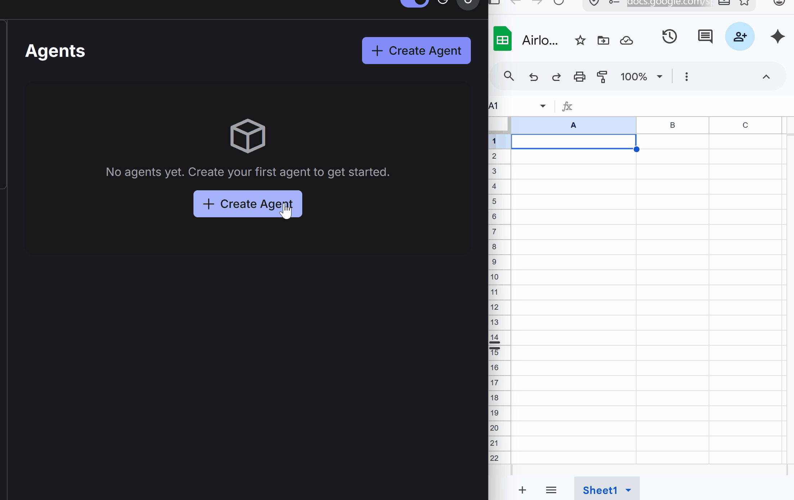

# Airlock

<p align="center">
  
</p>

Airlock is a self-hosted platform for creating and deploying AI-native apps. Build an app in Go or prompt one into existence, then run it with web UI, AI chat, APIs, authentication, storage, integrations, logs, and its own subdomain on infrastructure you control.

- [Website](https://airlock.run)
- [Documentation](https://airlock.run/docs/)
- [Installation guide](https://airlock.run/docs/installation/)
- [Agent SDK and CLI](https://airlock.run/docs/agentsdk/)
- [Releases](https://github.com/airlockrun/airlock/releases)

## Development

Development requires Go 1.26+, Docker with Compose v2, and pnpm. Start from the development environment preset:

```bash
cp .env.dev.example .env
cd frontend && pnpm install && cd ..
make dev
```

`make dev` starts the bundled infrastructure and ingress services, watches the frontend, and runs the Airlock server from source. Set `AGENT_LIBS_PATH` in `.env` to build apps against local `agentsdk`, `goai`, and `sol` source.

See [CONTRIBUTING.md](CONTRIBUTING.md) for contribution guidelines and [AGENTS.md](AGENTS.md) for repository architecture and development rules.

## Companion projects

- [agentsdk](https://github.com/airlockrun/agentsdk) - Go SDK and CLI for Airlock apps
- [goai](https://github.com/airlockrun/goai) - Go toolkit for building AI-powered applications
- [sol](https://github.com/airlockrun/sol) - agent runtime and coding harness

## License

[AGPL-3.0](LICENSE). The community edition is fully usable when self-hosted. Some operational features, including SSO/OIDC and audit-log export, are available under a commercial license. Contact `hello@airlock.run` for commercial licensing.

The companion libraries are licensed under Apache-2.0.

## Security

Report vulnerabilities to `security@airlock.run`. Do not open a public issue for security reports.
